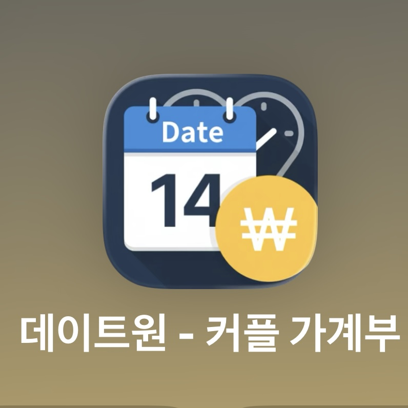
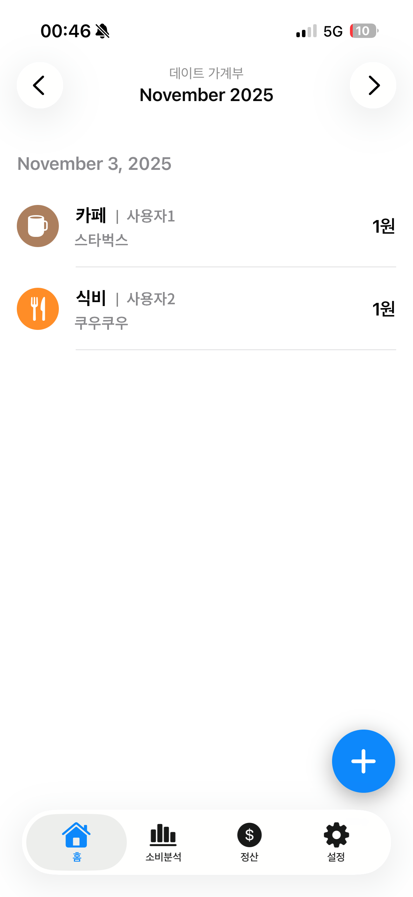
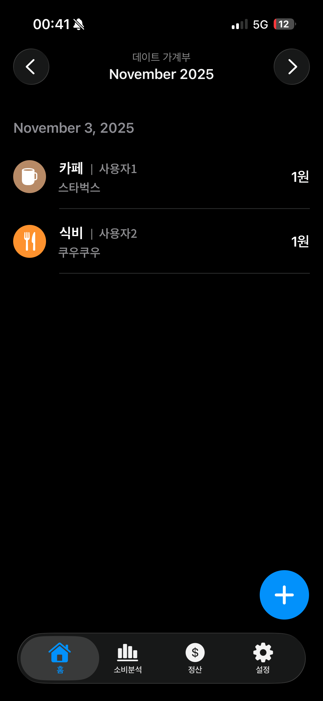
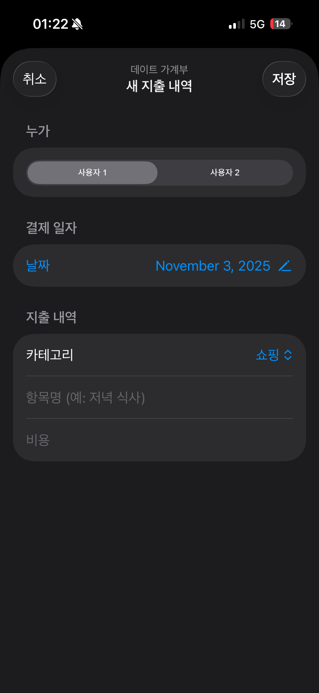
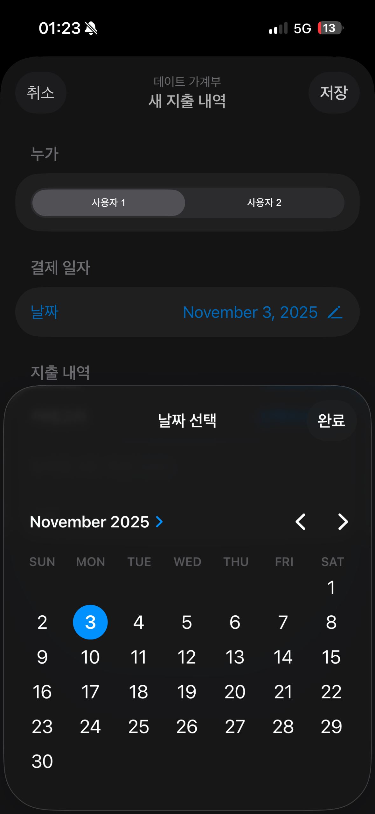
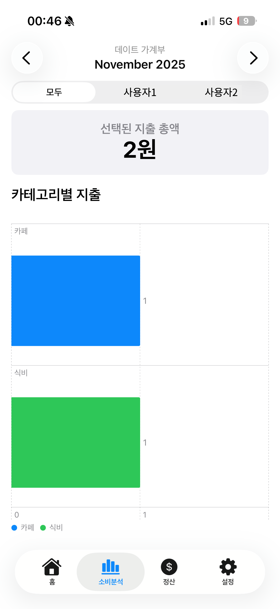
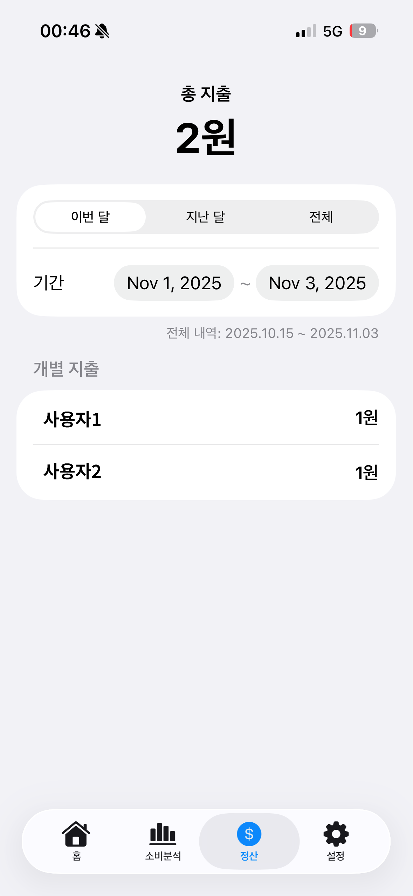
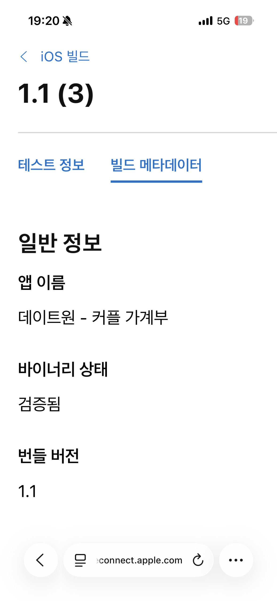
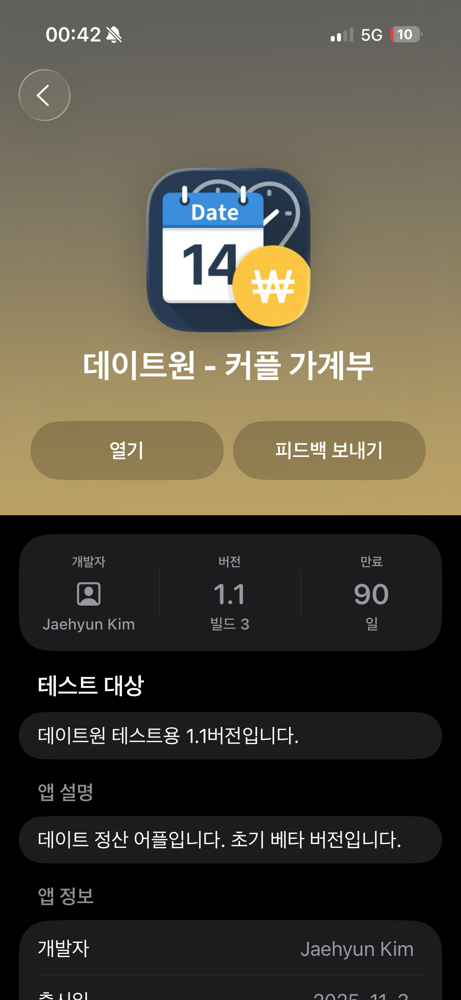

# 💰 DateOne

> **커플의 공동 지출 기록·분석·정산을 위한 iOS 가계부 서비스**

DateOne은 커플이 데이트 과정에서 발생한 지출을 함께 기록하고,
각자의 소비 내역을 확인하며 정산할 수 있도록 개발한 개인 iOS 프로젝트입니다.

단순한 개인 가계부와 달리 하나의 지출 기록 안에
**누가 결제했는지 함께 관리하고, 두 사람의 소비를 비교할 수 있는 구조**를 중심으로 개발했습니다.

  

---

## 🔍 Project Overview

데이트 비용을 메신저나 메모장에 따로 기록하거나,
나중에 한 사람이 다시 계산해야 하는 불편함에서 프로젝트를 시작했습니다.

하나의 가계부 안에서 두 사용자의 지출을 함께 기록하고,

`지출 기록`
→ `내역 관리`
→ `소비 분석`
→ `사용자별 비교`
→ `정산`

으로 이어지는 흐름을 구현했습니다.

  
  

---

## 📱 Key Features

### 💳 Shared Expense Tracking

지출을 등록할 때 결제한 사용자를 선택하고,
날짜와 카테고리, 항목명, 금액을 함께 기록할 수 있도록 구성했습니다.

- 사용자별 결제자 선택
- 날짜 지정
- 소비 카테고리 선택
- 지출 항목 및 금액 입력
- 날짜별 지출 내역 조회
- 기존 지출 수정 및 삭제

두 사람의 지출이 하나의 타임라인에 함께 표시되기 때문에
누가 어떤 항목을 결제했는지 쉽게 확인할 수 있습니다.

  
  

---

### 📊 Spending Analysis

기록된 데이터를 단순히 보관하는 데 그치지 않고,
기간과 사용자에 따라 소비 현황을 확인할 수 있도록 분석 기능을 구현했습니다.

- 월별 소비 내역 조회
- 전체 / 사용자별 소비 필터
- 선택 기간의 총 지출 확인
- 카테고리별 소비 분석
- 사용자별 소비 금액 비교

이를 통해 두 사람의 소비가 어떤 항목에 집중되어 있는지
한눈에 확인할 수 있도록 구성했습니다.

  
  

---

### 💵 Settlement

데이트 기간 동안 각 사용자가 부담한 금액을
별도로 계산하지 않아도 확인할 수 있도록 정산 기능을 구현했습니다.

`이번 달` / `지난 달` / `전체`

단위로 조회할 수 있으며,
원하는 기간을 지정해 각 사용자의 지출 금액을 비교할 수도 있습니다.

이를 통해 현재까지 두 사람이 각각 얼마를 부담했는지
빠르게 확인할 수 있도록 했습니다.

---

### 🌗 iOS User Experience

실제 iPhone에서 사용하는 앱인 만큼
기능뿐 아니라 iOS 환경에서의 사용 경험도 함께 고려했습니다.

Light Mode와 Dark Mode에 모두 대응하고,
하단 Tab 기반으로 주요 기능을 이동할 수 있도록 구성했습니다.

`홈` · `소비분석` · `정산` · `설정`

화면으로 주요 기능을 구분해
반복적으로 사용하는 기능에 빠르게 접근할 수 있도록 했습니다.

---

## 👨‍💻 My Role

DateOne은 **개인 프로젝트로 기획부터 개발, 테스트, 베타 배포까지 직접 진행했습니다.**

### Planning & Development

- 커플 공동 가계부의 기능과 사용자 흐름 기획
- 사용자별 지출 데이터 구조 설계
- 지출 등록·수정·삭제 기능 구현
- 월별 및 카테고리별 소비 분석 기능 개발
- 사용자별 지출 비교 및 정산 기능 구현
- 설정 및 사용자 관리 화면 구성
- Light / Dark Mode 대응

### Testing & Distribution

- 실제 iPhone 환경에서 기능 및 UI 테스트
- 지출 등록부터 분석·정산까지 전체 사용자 흐름 검수
- 반복적인 빌드와 실기기 테스트를 통한 오류 수정
- App Store Connect를 통한 iOS 빌드 등록 및 검증
- TestFlight 베타 배포 및 사용자 테스트 진행

개발 환경에서 기능이 동작하는 것에 그치지 않고,
**실제 사용자가 설치해 사용할 수 있는 베타 버전까지 직접 배포하는 과정**을 경험했습니다.

---

## 🚀 TestFlight Beta

개발한 앱을 실제 사용자 환경에서 검증하기 위해
App Store Connect와 TestFlight를 활용해 베타 테스트를 진행했습니다.

버전 업데이트와 빌드를 반복하며 기능을 개선했고,
`1.1` 버전까지 TestFlight 테스트를 진행했습니다.

  
  

이를 통해

`기획`
→ `개발`
→ `실기기 테스트`
→ `빌드`
→ `TestFlight 배포`
→ `사용자 피드백`

까지 iOS 앱 개발의 전체 흐름을 직접 경험했습니다.

---

## 💬 Beta Feedback

TestFlight를 통해 실제 사용 피드백을 받아보면서
처음 기획 단계에서는 생각하지 못했던 요구사항도 확인할 수 있었습니다.

> **Calendar**
>
> 월·일별 총 지출을 달력에서 한눈에 확인하고,
> 일정 금액 이상을 사용한 날을 강조해서 보여주면 좋겠다는 의견

> **Couple Experience**
>
> 커플을 위한 서비스인 만큼
> D-Day나 기념일을 함께 확인할 수 있으면 좋겠다는 의견

> **Smart Categorization**
>
> 지출 항목명을 입력하면
> 카테고리가 자동으로 분류되면 편리하겠다는 의견

> **Shared Payment**
>
> 한 번의 지출을 두 사람이 함께 부담하는 경우도 있기 때문에
> 비용 분담 구조가 필요하다는 의견

이러한 피드백을 통해
기능적으로 개선할 부분뿐 아니라
**서비스 자체의 방향성을 다시 고민하게 되었습니다.**

---

## 💡 Product Reflection

개발 초기에는
"커플이 데이트 비용을 함께 기록하고 정산하는 앱"을 목표로 시작했습니다.

하지만 베타 테스트를 진행하면서
서비스의 핵심 가치가 명확하게 정의되지 않았다는 점을 발견했습니다.

### 기록인가, 정산인가?

DateOne의 중심이

**데이트 지출을 차곡차곡 기록하는 가계부**인지,

아니면

**두 사람의 비용 부담을 계산하는 정산 서비스**인지

명확하게 구분할 필요가 있었습니다.

### 데이트 가계부인가, 공동 가계부인가?

또한 관리할 지출의 범위도 고민하게 되었습니다.

현재의 데이트 비용만을 대상으로 할 것인지,
장기적으로 함께 미래를 계획하는 커플이나 부부의
전체 생활비까지 관리하는 서비스로 확장할 것인지에 따라
필요한 기능과 타깃 사용자도 크게 달라질 수 있었습니다.

결국 기능을 계속 추가하는 것보다,

**누구의 어떤 문제를 해결할 것인지 먼저 정의하는 과정이 필요하다**

고 판단했습니다.

---

## 🎯 What I Learned

DateOne을 통해
개발 능력만큼 **제품의 문제 정의와 시장 검증이 중요하다는 점**을 배웠습니다.

처음부터 구현하고 싶은 기능을 쌓기보다,

`시장 조사`
→ `Target User 정의`
→ `Problem 정의`
→ `핵심 가치 설정`
→ `기능 설계`
→ `개발`
→ `사용자 검증`

순서로 접근하는 것이 필요하다는 점을 경험했습니다.

기존 가계부 서비스를 단순히 기능적으로 따라가는 것으로는
사용자가 기존 서비스를 떠나 DateOne을 선택해야 할 이유를 만들기 어렵다고 판단했습니다.

다시 프로젝트를 발전시킨다면
**커플 가계부 / 데이트 정산 / 공동 생활비 관리** 중
명확한 시장과 사용자를 먼저 선정하고,
시장조사와 사용자 검증을 거친 뒤 제품을 다시 설계하고자 합니다.

---

## 📌 Result

- 커플 공동 지출 기록 및 관리 기능 구현
- 사용자별 소비 분석 및 정산 기능 개발
- Light / Dark Mode를 고려한 iOS UI 구성
- 실제 iPhone 환경에서 기능 테스트 및 검수
- App Store Connect 빌드 등록 및 검증
- TestFlight 베타 버전 배포
- 실제 사용자 피드백 수집
- 피드백을 기반으로 서비스 타깃과 제품 방향성 재검토

---

## 🛠 Platform & Distribution

**Platform**  
`iOS` `Swift`

**Distribution & Testing**  
`App Store Connect` `TestFlight`
