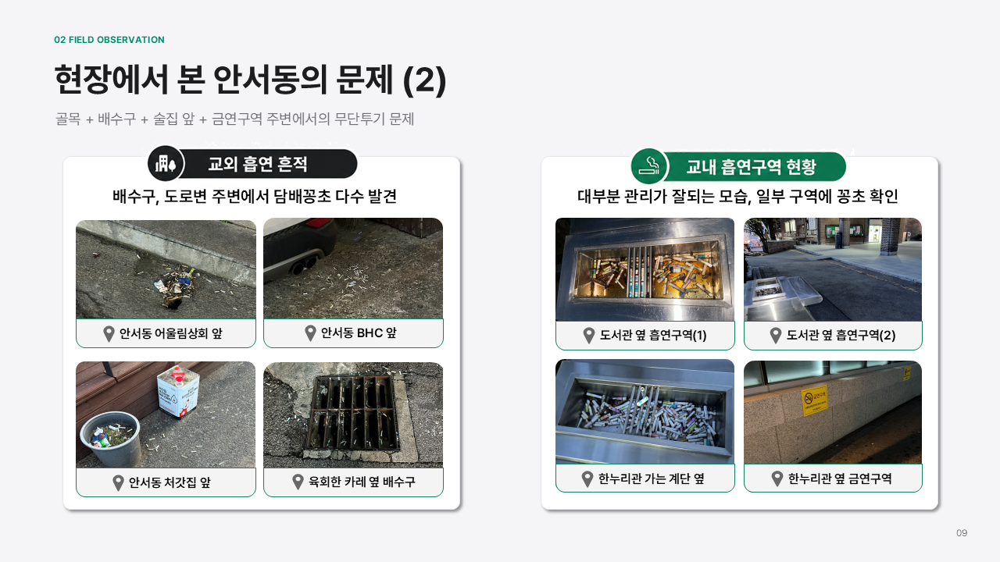
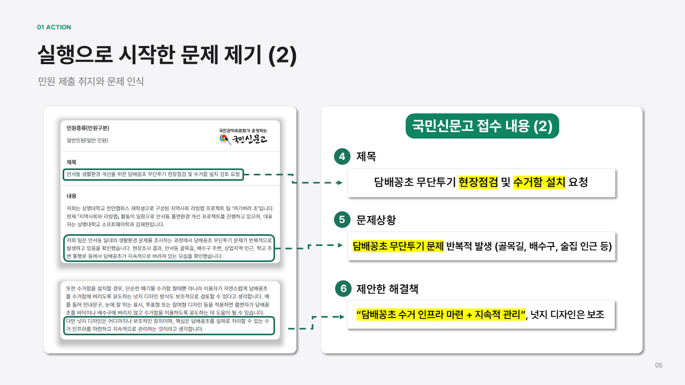
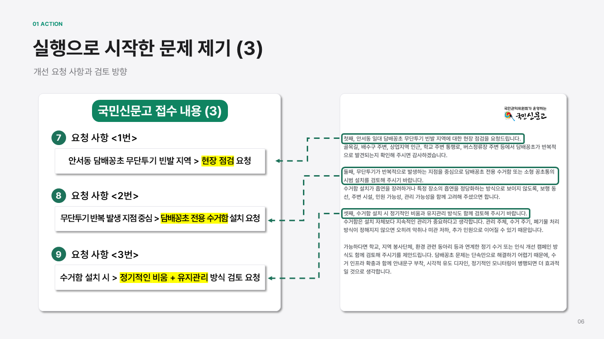
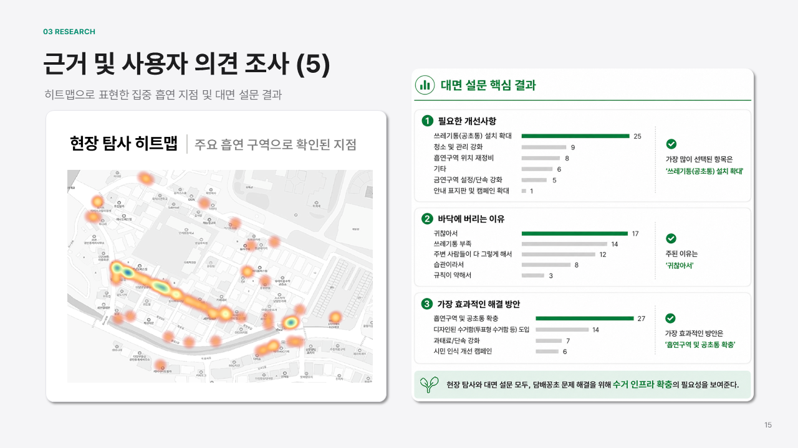
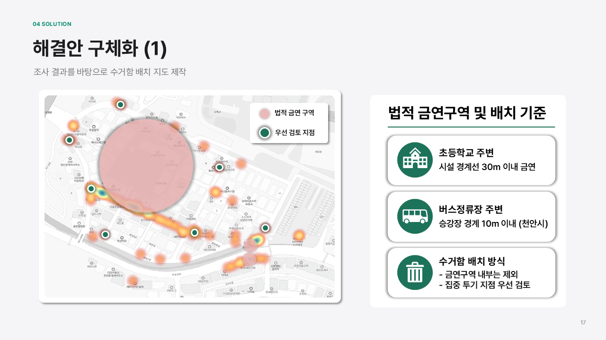
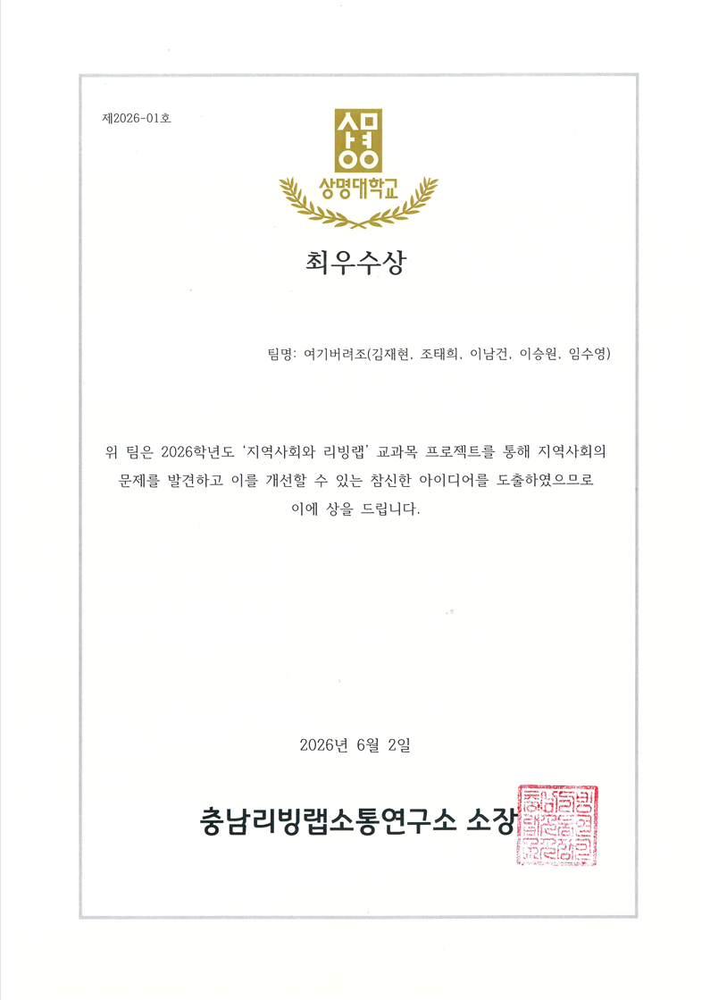

## 🚭 안서동 흡연환경 개선 프로젝트

> **지역사회와 리빙랩 | Team Project | 2026**

대학가 주변에서 발생하는 **무분별한 흡연과 담배꽁초 투기 문제**를 지역사회 문제로 정의하고,  
현장조사와 사용자 의견을 바탕으로 실현 가능한 개선방안을 설계한 **지역사회 리빙랩 프로젝트**입니다.

### 🔍 Problem
- 안서동 대학가 주변의 흡연구역 부족 및 무분별한 흡연 문제 확인
- 담배꽁초 무단투기로 인한 거리 환경 및 비흡연자 불편 문제 분석
- 단순 시설 설치가 아닌 **실제 행정·운영 가능성을 고려한 해결방안** 필요

  

### 🛠 What I Did
- 현장조사를 통해 흡연환경과 주요 문제 지점 분석
- 설문조사를 진행하여 **흡연시설 설치 후보지 7곳 선정**
- 조사 결과를 바탕으로 흡연시설 **목업(Mock-up) 직접 설계**
- **국민신문고를 통해 관련 행정기관에 직접 문의**하고 공식 답변 확보
- 시설 설치 가능 여부와 행정 절차를 확인하기 위해 **관련 부서 간 협의 요청**
- 조사·행정기관 피드백을 반영하여 현실적인 설치 및 운영방안 구체화

  
  

### 💡 Approach

`문제 발견` → `현장 조사` → `사용자 의견 수집` → `후보지 선정` → `행정기관 문의` → `목업 설계` → `해결방안 제안`

아이디어 제안에 그치지 않고 **사용자 의견, 현장 조건, 행정적 실현 가능성**을 함께 검토하며 실제 적용 가능한 해결책을 만드는 데 집중했습니다.

### 🏆 Result
- 흡연환경 개선을 위한 구체적인 시설 및 운영방안 제안
- 설문조사를 기반으로 설치 후보지 **7곳 도출**
- 국민신문고 및 관련 부서 협의를 통한 **행정적 실현 가능성 검토**
- **충남리빙랩연구소 소장 명의 최우수상 수상**

  
  
  

### 📌 Key Experience
`Living Lab` `Problem Solving` `User Research` `Survey` `Prototyping` `Public Communication` `Team Collaboration`
