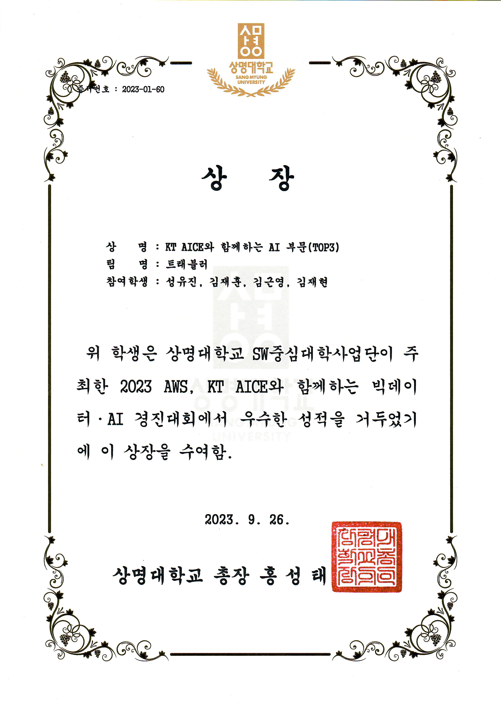

# ⚖️ TraChat

> **판결문 데이터 기반의 교통사고 형량 예측 AI 챗봇**

[🏫 Featured on Sangmyung University Instagram](https://www.instagram.com/p/CzdMbSzxgBM/)

TraChat은 사용자가 자신의 교통사고 상황을 입력하면,
판결문 데이터를 학습한 AI 모델을 통해 예상 형벌과 형량을 제공하는 챗봇 서비스입니다.

기존 서비스가 정해진 질문이나 일부 사고 유형 중심으로 제공된다는 점에 주목해,
사용자가 자신의 상황을 직접 입력하고 결과를 확인할 수 있는 형태로 개발했습니다.

---

## 🔍 Project Overview

프로젝트는 다음 흐름으로 구성했습니다.

`판결문 수집`
→ `데이터 전처리`
→ `AI 모델 학습`
→ `서버 연동`
→ `카카오 챗봇 결과 제공`

교통사고 관련 판결문을 수집하고 학습 가능한 데이터로 가공한 뒤,
KoBERT 기반 모델을 통해 형벌과 형량을 예측하도록 구성했습니다.

최종적으로 AI 모델을 카카오 챗봇과 연동해
사용자가 자신의 사고 상황을 직접 입력하고 예측 결과를 확인할 수 있도록 구현했습니다.

---

## 🗂 Data Collection & Preprocessing

교통사고 관련 판결문 데이터는 두 가지 방식으로 확보했습니다.

- 대한민국 법원 대국민 서비스의 판결문 미리보기 Crawling
- 국가법령정보센터 API를 활용한 판결문 수집

법원 판결문 미리보기는 전체 내용을 제공하지 않아,
수집된 데이터 중 상당수의 `이유` 내용이 잘려 있는 문제가 있었습니다.

이를 보완하기 위해 온전한 API 데이터와 Crawling 데이터를 함께 활용하고,
**GPT-3.5 Turbo를 사용해 손실된 판결문의 내용을 복원하고 요약하는 전처리 과정**을 진행했습니다.

판결문에서는 다음 정보를 중심으로 학습 데이터를 구성했습니다.

- `이유` : 피고인의 교통사고 상황
- `주문` : 선고된 형벌 및 형량

또한 `주문`에서 형벌과 양형 정보를 추출하고,
사용이 어려운 데이터를 제거해 학습 가능한 형태로 정제했습니다.

### Data Flow

`Crawling Data`
+ `API Data`
→ `GPT-3.5 Turbo를 활용한 손실 데이터 복원 및 요약`
→ `형벌·형량 정보 추출`
→ `사용 불가 데이터 제거`
→ `AI 학습용 데이터셋 구성`

- 전처리 전: 약 31,019건
- 전처리 후: 약 28,325건

---

## 🧠 AI Modeling

전처리한 판결문 데이터를 기반으로
SKTBrain의 **KoBERT 사전학습 모델을 활용해 전이학습**을 진행했습니다.

예측 모델은 다음과 같이 구성했습니다.

- 형벌 결정 모델
- 형종별 양형 결정 모델
- 집행유예 양형 결정 모델

형벌마다 선고되는 형량의 형태가 다르기 때문에
형종별 데이터셋을 별도로 구성했습니다.

또한 연속형 데이터인 형량을 일정 구간별 Class로 나누어 다중분류 형태로 학습하고,
데이터 불균형 문제를 줄이기 위해 각 Label 수에 반비례한 가중치를 손실함수에 적용했습니다.

---

## 💬 Chatbot

AI 모델의 결과를 실제 사용자가 쉽게 이용할 수 있도록
카카오 챗봇 형태로 서비스를 구현했습니다.

사용자가 사고 상황을 입력하면:

`Kakao Chatbot`
→ `Webhook`
→ `Server`
→ `AI Model`
→ `Prediction Result`
→ `Kakao Chatbot`

순서로 처리됩니다.

챗봇은 되묻기 질문을 통해 사용자의 입력을 보완하고,
입력된 사고 상황을 서버로 전달한 뒤
AI 모델의 예측 결과를 정해진 응답 형태로 사용자에게 제공합니다.

---

## 👨‍💻 My Role

프로젝트에서 **데이터 수집, 데이터 전처리, 챗봇 설계**를 담당했습니다.

### Data Collection
- 대한민국 법원 대국민 서비스 판결문 미리보기 Crawling
- 국가법령정보센터 API를 활용한 판결문 데이터 수집
- Crawling 데이터와 API 데이터 결합

### Data Preprocessing
- Crawling 과정에서 손실된 판결문 데이터 확인
- GPT-3.5 Turbo를 활용한 손실 내용 복원 및 요약
- 판결문의 `이유`와 `주문`을 기준으로 데이터 구조화
- `주문`에서 형벌 및 형량 정보 추출
- 사용 불가능한 데이터 제거 및 학습 데이터셋 정제

### Chatbot Design
- 사용자 질문 흐름과 챗봇 대화 구조 설계
- 사용자 입력값을 서버로 전달하는 Webhook 흐름 구성
- AI 예측 결과를 사용자에게 전달하는 응답 구조 설계
- 카카오 챗봇과 AI 모델을 연결하는 서비스 흐름 구현

특히 **불완전한 원천 데이터를 AI 학습에 활용할 수 있는 형태로 정제하는 과정부터,
모델의 결과를 실제 사용자가 이용할 수 있는 챗봇 서비스로 연결하는 과정까지** 담당했습니다.

---

## 🏆 Result

- 교통사고 관련 판결문 약 3만 건 수집
- 약 2.8만 건 규모의 학습 데이터 구성
- KoBERT 기반 형벌·형량 예측 모델 개발
- 카카오 챗봇 기반 형량 예측 서비스 구현
- **2023 AWS · KT AICE 빅데이터·AI 경진대회 KT 부문 TOP 3**

  

---

## 🛠 Tech Stack

`Python` `KoBERT` `GPT-3.5 Turbo`
`Flask` `Selenium` `Kakao Chatbot`
`Webhook` `Google Colab`
