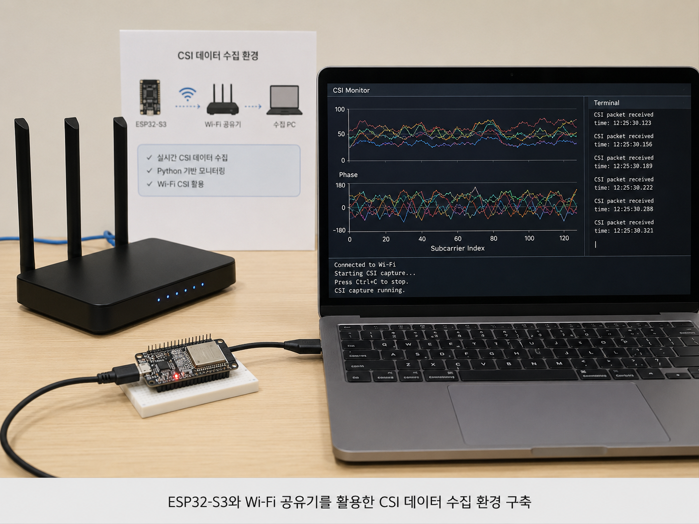
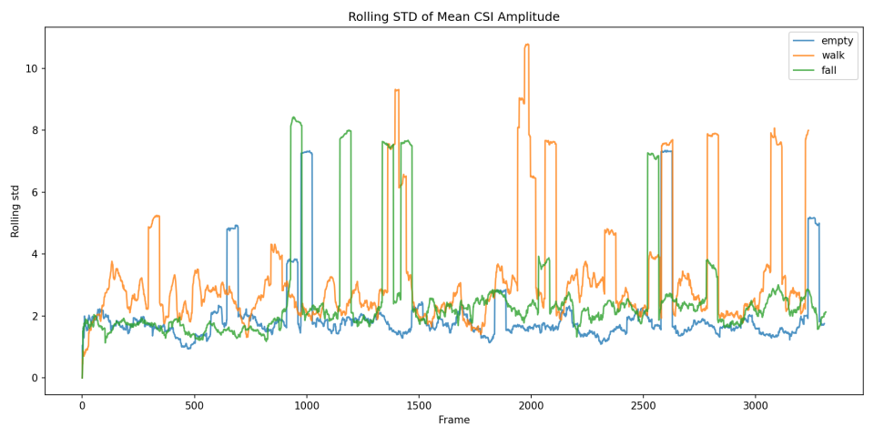
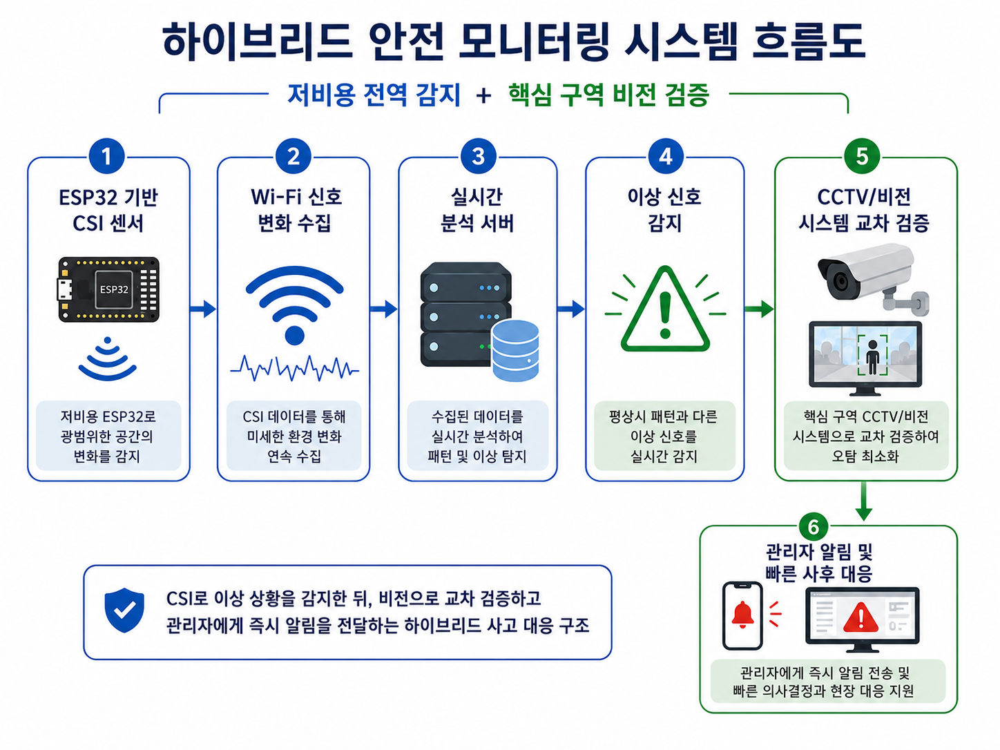

# 📡 Wi-Fi Sensing 기반 낙상 감지

> **ESP32와 Wi-Fi CSI를 활용해 저비용 낙상 감지의 가능성과 한계를 검증하고,
> 이를 안전 모니터링 창업 아이디어로 확장한 프로젝트**

[▶ Project Video](https://youtu.be/SbuymPcJXyY?si=OuZVVarYVgGhGvIr)

카메라나 웨어러블 없이도 Wi-Fi 신호 변화를 이용해
사람의 움직임과 낙상 상황을 감지할 수 있는지 직접 실험한 프로젝트입니다.

ESP32-S3를 활용해 CSI(Channel State Information) 데이터를 수집하고,
Python으로 신호를 실시간 시각화하며 다양한 움직임에 따른 변화를 비교했습니다.

단순히 낙상 감지 기능을 완성하는 것보다,
**저비용 Wi-Fi Sensing 방식이 실제 환경에서 어디까지 활용 가능한지 검증하고
그 과정에서 발생하는 기술적 한계를 분석하는 것**에 초점을 두었습니다.

---

## 🔍 Project Overview

프로젝트는 노인 낙상 사고와 기존 감지 방식의 한계에 대한 문제의식에서 시작했습니다.

CCTV는 직관적인 감지가 가능하지만
비용, 사각지대, 프라이버시 문제가 존재하고,
웨어러블 방식은 사용자가 장비를 지속적으로 착용해야 한다는 한계가 있습니다.

이에 별도의 영상 촬영 없이
Wi-Fi 신호 변화를 통해 움직임을 감지하는
**Wi-Fi CSI 기반 낙상 감지 방식**의 적용 가능성을 검토했습니다.

프로젝트는 다음 흐름으로 진행했습니다.

`선행연구 조사`
→ `ESP32 실험 환경 구축`
→ `CSI / RSSI 데이터 수집`
→ `Python 실시간 시각화`
→ `행동별 신호 비교`
→ `실험 구조 개선`
→ `사전학습 모델 적용`
→ `가능성과 한계 분석`

---

## 💡 Why Wi-Fi Sensing?

Wi-Fi Sensing은 기존 방식과 비교했을 때
다음과 같은 가능성이 있다고 판단했습니다.

- 카메라 없이 움직임 감지 가능
- 영상 촬영에 따른 프라이버시 부담 감소
- 저비용 임베디드 장치 활용 가능
- 기존 Wi-Fi 환경과의 결합 가능성
- 넓은 공간을 대상으로 한 감지 구조로 확장 가능

특히 카메라 설치가 어렵거나
사생활 보호가 중요한 공간에서 활용 가능성이 있다고 보았습니다.

---

## 🧪 Experiment & Implementation

### CSI Data Collection

ESP32-S3와 ESP-IDF를 활용해
Wi-Fi CSI 데이터를 수집할 수 있는 실험 환경을 구축했습니다.

초기에는 Wi-Fi 공유기와 ESP32를 연결해 데이터를 수집하고,
Python을 이용해 CSI 값을 실시간 그래프로 시각화했습니다.

주변 환경과 사람의 움직임에 따라
신호가 어떻게 변화하는지 직접 관찰하며
낙상 판단에 활용할 수 있는 특징을 탐색했습니다.

<!--
이미지 출처:
'모두의 창업.pdf' 4페이지
ESP32-S3 + 공유기 + 노트북 + CSI Monitor가 함께 나온 실제 실험 환경 사진
파일명 추천: csi-environment.jpg
-->

  

---

### Movement Experiment

다음과 같은 조건을 나누어 데이터를 수집했습니다.

- 사람이 없는 상태
- 일반적인 보행
- 빠른 움직임
- 낙상과 유사한 동작

초기에는 일정 수준 이상의 신호 변화가 발생하면
낙상으로 판단하는 단순 임계값 방식도 검토했습니다.

하지만 실제 환경에서는

- 순간적인 spike
- garbage 값
- 주변 환경 변화
- Wi-Fi 환경에 따른 데이터 불안정

등의 영향이 커
단순한 임계값만으로 낙상을 안정적으로 구분하기 어렵다는 점을 확인했습니다.

---

## 🔄 Challenges & Iteration

실험 결과가 예상과 다르게 나타나면서
문제 원인을 찾고 실험 방식을 반복적으로 수정했습니다.

### Experimental Setup

초기에는 공유기와 ESP32를 활용했지만,
Wi-Fi 환경이 데이터 불안정에 영향을 줄 가능성이 있다고 판단했습니다.

이에 공유기를 제외하고
**ESP32 두 대가 직접 통신하도록 실험 구조를 변경**했습니다.

또한 외부 변수를 줄이기 위해

- 실험 공간 내 장비 최소화
- 실험 인원을 공간 밖으로 이동
- 동일 조건에서 행동별 데이터 반복 수집

등의 방법으로 실험 환경을 통제했습니다.

불안정한 값은 일부 감소했지만,
걷기와 낙상을 명확하게 구분할 수 있을 정도의
일관된 데이터 확보에는 여전히 한계가 있었습니다.

---

### Signal Processing

CSI 원시값 자체만으로 판단하기 어렵다고 보고
다음과 같은 특징을 활용하는 방향을 검토했습니다.

- Amplitude
- 변화량
- 평균
- 표준편차
- 시간에 따른 신호 변화

또한 선행연구를 참고해
CSI 수집 방법과 하위 반송파별 데이터 구조를 다시 검토하며
데이터 측정 단계부터 재구성했습니다.

---

## 🧠 Pre-trained Model Experiment

프로젝트 후반에는
기존 Wi-Fi Sensing 연구에서 사용된 사전학습 모델을
직접 수집한 ESP32 CSI 데이터에 적용해보았습니다.

ESP32의 CSI 데이터를 파싱한 뒤
I/Q 값을 64개의 amplitude 값으로 변환하고,
모델 입력 형태에 맞도록 `10 × 64` window 구조로 구성했습니다.

다음 세 가지 상황을 비교했습니다.

`empty` · `walk` · `fall`

사전학습 모델과 ESP32 데이터를 연결해
**실시간 예측 결과를 출력하는 단계까지는 성공했습니다.**

하지만 실제 테스트에서는

- 결과가 `walk`로 편향되는 현상
- 낙상이 아닌 상황에서 `fall`이 출력되는 오탐
- 정지 상태에서도 발생하는 spike
- 사전학습 데이터와 자체 수집 데이터의 분포 차이

등의 문제가 나타났습니다.

자체 데이터에서도
`empty`와 움직임 상태는 일부 차이를 확인할 수 있었지만,
`walk`와 `fall`은 안정적으로 분리되지 않았습니다.

이를 통해 기존 모델을 그대로 적용하기보다
**실제 장비와 환경에 맞는 데이터 수집, 전처리와 재학습이 필요하다는 점**을 확인했습니다.

<!--
이미지 출처:
'1-8주차_보고서.pdf' 8페이지
또는 '8주차_활동보고서.pdf'
empty / walk / fall 실험 및 CSI 데이터 분석 그래프 영역
파일명 추천: csi-analysis.png
-->

  

---

## 🚀 Startup Extension

실험 과정에서 확인한 가능성과 한계를 바탕으로
프로젝트를 **2026 모두의 창업** 창업 아이디어로 확장했습니다.

처음에는 독거노인의 낙상 사고를 빠르게 발견하는 문제에서 출발했지만,
조사를 진행하며 공장·건설 현장·물류센터와 같은 넓은 공간에서도
비슷한 안전 사각지대가 존재한다는 점에 주목했습니다.

Wi-Fi CSI만으로 모든 사고를 판단하기보다
각 기술의 장점을 결합하는 방향으로 시스템을 구체화했습니다.

### Hybrid Safety Monitoring

`ESP32 기반 CSI 전역 감지`
→ `Wi-Fi 신호 변화 분석`
→ `이상 신호 탐지`
→ `CCTV / Vision 교차 검증`
→ `관리자 알림`

넓은 공간에는 저비용 CSI 센서를 분산 배치하고,
핵심 구역에만 CCTV 또는 비전 장비를 활용하는 방식입니다.

목표는 사고를 완벽히 예측하는 것이 아니라,
**사고 발생 직후 이상 상황을 빠르게 감지하고
관리자가 대응할 수 있는 시간을 확보하는 것**입니다.

<!--
이미지 출처:
'모두의 창업.pdf' 3페이지
'하이브리드 안전 모니터링 시스템 흐름도'
파일명 추천: hybrid-system.png
-->

  

---

## 👨‍💻 My Role

프로젝트에서 **팀장을 맡아 전체 실험 방향과 프로젝트 진행을 조율**했습니다.

### Research & Planning
- Wi-Fi CSI 및 낙상 감지 관련 선행연구 조사
- 기존 CCTV / Wearable 기반 감지 방식 비교
- 프로젝트 실험 방향 및 단계별 목표 설정
- 팀원들과 낙상 감지 로직과 개선 방향 검토

### Experiment & Analysis
- ESP32-S3 기반 CSI 데이터 수집 환경 구축
- ESP-IDF 기반 Wi-Fi CSI 실험 진행
- Python 기반 실시간 데이터 시각화 및 분석
- 행동 조건별 CSI / RSSI 변화 비교
- 데이터 불안정 문제에 따른 실험 구조 개선
- 선행연구 및 사전학습 모델 적용 가능성 검토

### Project Extension
- 기존 실험 결과를 모두의 창업 아이디어로 구체화
- 독거노인 중심 문제를 산업 안전 영역까지 확장
- CSI 전역 감지 + Vision 교차 검증 구조 기획
- 프로젝트 필요성, 기술적 한계와 확장 가능성 정리

단순히 처음 계획한 방식을 유지하기보다,
**실험 결과에 따라 문제를 다시 정의하고
실험 구조와 접근 방법을 반복적으로 수정하는 과정**을 경험했습니다.

---

## 💡 What I Learned

처음에는 저비용 ESP32만으로도
낙상과 일반적인 움직임을 비교적 쉽게 구분할 수 있을 것이라고 예상했습니다.

하지만 실제 실험에서는

- 장비 특성
- Wi-Fi 환경
- 주변 물체
- 측정 조건
- 순간적인 노이즈

등 다양한 변수가 CSI 데이터에 큰 영향을 주었습니다.

특히 기존 연구에서 높은 성능을 보인 모델이라도
**장비와 데이터 수집 환경이 달라지면 동일한 결과를 기대하기 어렵다는 점**을 직접 확인했습니다.

프로젝트를 진행하며

`선행연구 검토`
→ `가설 설정`
→ `실험`
→ `결과 분석`
→ `원인 추정`
→ `환경 재구성`
→ `재실험`

과정을 반복했습니다.

또한 기술적인 한계를 숨기기보다,
현재 방식의 한계를 인정하고
CCTV·Vision 등 다른 기술과 결합하는 방향으로
솔루션을 다시 설계하는 것도 문제 해결 과정이라는 점을 배웠습니다.

---

## 📌 Result

- ESP32-S3 기반 Wi-Fi CSI 데이터 수집 환경 구축
- Python 기반 CSI 실시간 시각화 구현
- 행동 조건별 CSI / RSSI 데이터 수집 및 비교
- 공유기 기반 구조에서 ESP32 간 직접 통신 구조로 실험 환경 개선
- CSI 데이터 전처리 및 특징 추출 방식 검토
- 사전학습 모델과 ESP32 CSI 데이터 연동
- 실시간 예측 출력 구현 및 모델 적용 한계 분석
- 저비용 Wi-Fi CSI 방식의 가능성과 기술적 한계 검증
- CSI + Vision 기반 하이브리드 안전 모니터링 구조 제안
- **2026 모두의 창업 창업 아이디어 제출**

---

## 🛠 Tech Stack

**Embedded / Network**  
`ESP32-S3` `ESP-IDF` `Wi-Fi CSI` `RSSI`

**Data Analysis**  
`Python` `NumPy` `Matplotlib`

**Experiment**  
`Signal Processing` `Pre-trained Model`
