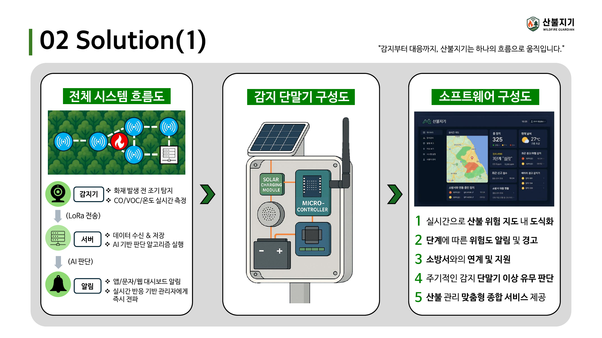
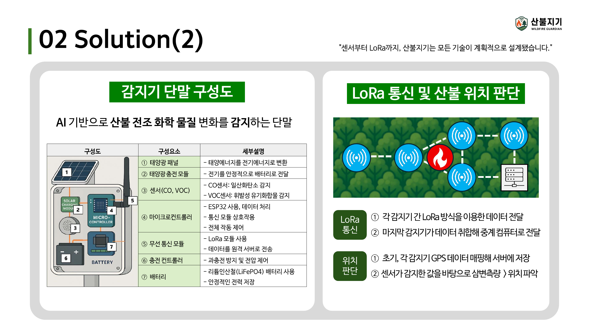
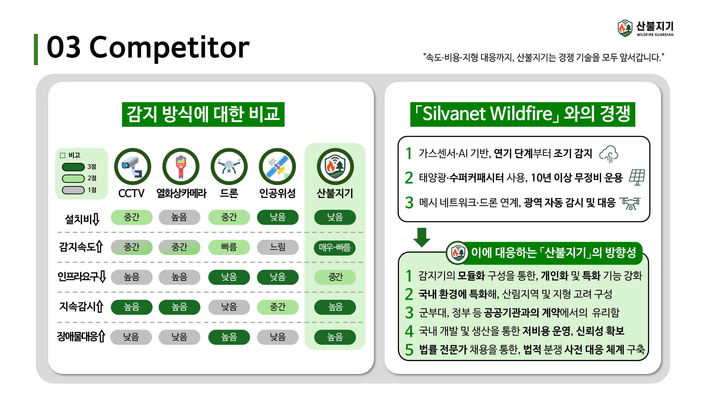
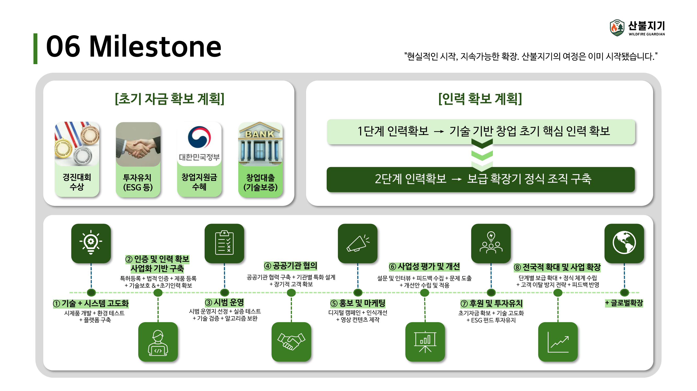

# 🌲 산불지기 (Wildfire Guardian)

> **AIoT 기반 산불 조기 감지 및 대응 솔루션**

산불지기는 산림 지역에 설치된 감지 단말을 통해  
**CO, VOC, 온도 등의 변화를 실시간으로 수집하고, AI 기반 판단과 LoRa 통신을 통해 산불을 조기에 탐지하는 시스템**입니다.

기존의 CCTV, 열화상카메라, 드론, 위성 중심 감지 방식의 한계를 보완하고,  
저비용·저전력·상시 감시가 가능한 분산형 산불 감지 체계를 목표로 설계했습니다.

---

## 🔍 Problem

산불은 조기 탐지가 늦어질수록 피해 규모가 급격히 커지지만,  
기존 감지 방식은 설치비, 감시 범위, 장애물 대응, 지속 감시 측면에서 한계가 있습니다.

특히 대형 산불의 경우:

- 인명 및 재산 피해 발생
- 대규모 산림 훼손
- 탄소 배출 증가
- 생태계 파괴
- 사회·경제적 피해 확대

로 이어질 수 있기 때문에,  
**더 빠르고 지속적인 초기 감지 체계**가 필요하다고 판단했습니다.

---

## 💡 Solution

산불지기는 산림 곳곳에 설치되는 감지 단말을 기반으로  
산불 징후를 실시간 수집하고 서버로 전송합니다.

### 전체 시스템 흐름

`센서 감지` → `LoRa 통신` → `서버 수집` → `AI 기반 판단` → `위험 알림`

### 주요 기능

- CO / VOC / 온도 등 실시간 감지
- LoRa 기반 저전력 장거리 통신
- 감지 데이터를 서버에 수집 및 저장
- AI 기반 산불 위험 판단
- 위험 단계별 알림 및 경고
- 산불 위험 지역 지도 시각화
- 감지 단말 이상 여부 점검
- 소방서 등 관계기관 연계 가능

  
  

---

## 🛠 Hardware

감지 단말은 저전력·독립형 운영을 목표로 구성했습니다.

### 주요 구성 요소

- 태양광 패널
- 태양광 충전 모듈
- CO / VOC 센서
- 마이크로컨트롤러
- LoRa 무선 통신 모듈
- 충전 컨트롤러
- LiFePO4 배터리

태양광 기반 충전을 통해 외부 전원 의존도를 줄이고,  
산림 지역에서도 장기간 독립적으로 동작할 수 있도록 설계했습니다.

---

## 📡 Communication & Detection

각 감지기는 LoRa 통신을 활용하여 데이터를 전달합니다.

1. 개별 감지기가 센서 데이터를 수집
2. LoRa 방식으로 데이터를 중계
3. 최종 데이터가 서버로 전달
4. GPS 정보와 센서 값을 기반으로 산불 발생 위치를 판단

이를 통해 통신 인프라가 부족한 산림 환경에서도  
저전력 기반의 장거리 통신 체계를 구축하는 것을 목표로 했습니다.

---

## 🖥 Software

소프트웨어는 수집된 데이터를 기반으로 산불 위험 상태를 시각화하고 관리할 수 있도록 구성했습니다.

### 주요 기능

- 실시간 산불 위험 지도
- 단계별 위험도 알림
- 감지 단말 상태 확인
- 실시간 반응 기반 관리자 대응
- 산불 관리 통합 서비스

---

## ⚔️ Competitor Analysis

기존 산불 감지 방식과 비교하여  
산불지기의 경쟁력을 다음과 같이 정리했습니다.

| 항목 | CCTV | 열화상카메라 | 드론 | 인공위성 | 산불지기 |
|---|---|---|---|---|---|
| 설치비 | 중간 | 높음 | 중간 | 낮음 | 낮음 |
| 감지속도 | 중간 | 중간 | 빠름 | 느림 | 매우 빠름 |
| 인프라 요구 | 높음 | 높음 | 낮음 | 낮음 | 중간 |
| 지속 감시 | 높음 | 높음 | 낮음 | 중간 | 높음 |
| 장애물 대응 | 낮음 | 낮음 | 높음 | 낮음 | 높음 |

산불지기는 특히  
**빠른 감지, 지속 감시, 저비용 분산형 설치**를 핵심 강점으로 설정했습니다.

  

---

## 🧩 Modular Design

산불지기는 고객 환경에 따라 센서를 추가할 수 있는 모듈형 구조를 목표로 했습니다.

예를 들어:

- 군부대: 동작 감지 / 음향 감지
- 산림청: 사람 감지
- 문화재 시설: 유증기 감지
- 기타 환경: 습도 / 기압 / 풍속 센서

등으로 확장할 수 있도록 설계했습니다.

즉, 산불 감지뿐 아니라  
다양한 환경 감시 목적에 맞춰 센서를 조합할 수 있는 구조입니다.

---

## 📈 Market & Business Model

### Target Market

- 산림청 및 공공기관
- 군부대
- 지자체
- 민간 산림 관리 기관
- 문화재 보호 지역

### 수익 모델

#### 1. 감지 단말 판매
- 약 300,000원 / 단말
- 약 90,000원 / ha 기준

#### 2. 구독형 서비스
- 시스템 사용 및 관리 서비스
- 연간 약 50,000원 / ha

### 시장 규모

- TAM: 약 1조 4,000억 원
- SAM: 약 1,400억 원
- SOM: 약 70억 원

---

## 🗺 Milestone

프로젝트의 사업화 로드맵은 다음과 같이 구성했습니다.

1. 기술 및 시스템 고도화
2. 인증 및 인력 확보
3. 시범 운영
4. 공공기관 협의
5. 홍보 및 마케팅
6. 사업성 평가 및 개선
7. 후원 및 투자 유치
8. 전국적 확대 및 사업 확장
9. 글로벌 확장

기술 구현뿐 아니라  
**실증, 행정, 시장 진입, 투자, 확장 단계까지 고려한 사업화 계획**을 함께 설계했습니다.

  

---

## 👨‍💻 My Role

저는 팀에서 **소프트웨어 및 AI 영역**을 담당했습니다.

### 주요 역할

- 서버 구축 및 유지관리
- 소프트웨어 개발 및 시스템 연동
- AI 모델 개발 및 연구
- 감지 데이터를 활용한 서비스 구조 설계
- 전체 시스템의 소프트웨어 관점 구현 가능성 검토

하드웨어, 센서, 통신, 소프트웨어를 하나의 시스템으로 연결하는 과정에서  
**AIoT 기반 산불 감지 서비스의 소프트웨어 구조를 구체화하는 역할**을 맡았습니다.

---

## 🏆 Result

- AIoT 기반 산불 조기 감지 솔루션 기획
- 하드웨어 / 통신 / 서버 / AI 통합 구조 설계
- 고객별 확장 가능한 모듈형 시스템 제안
- 시장 규모 및 수익 모델 설계
- 단계별 사업화 로드맵 수립
- **1사단 창업경진대회 우수상 수상**

  

---

## 📌 Key Experience

`AIoT` `AI` `LoRa` `Embedded System` `Server`  
`Wildfire Detection` `System Design` `Business Model` `Team Project`
